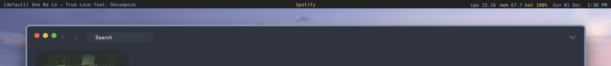
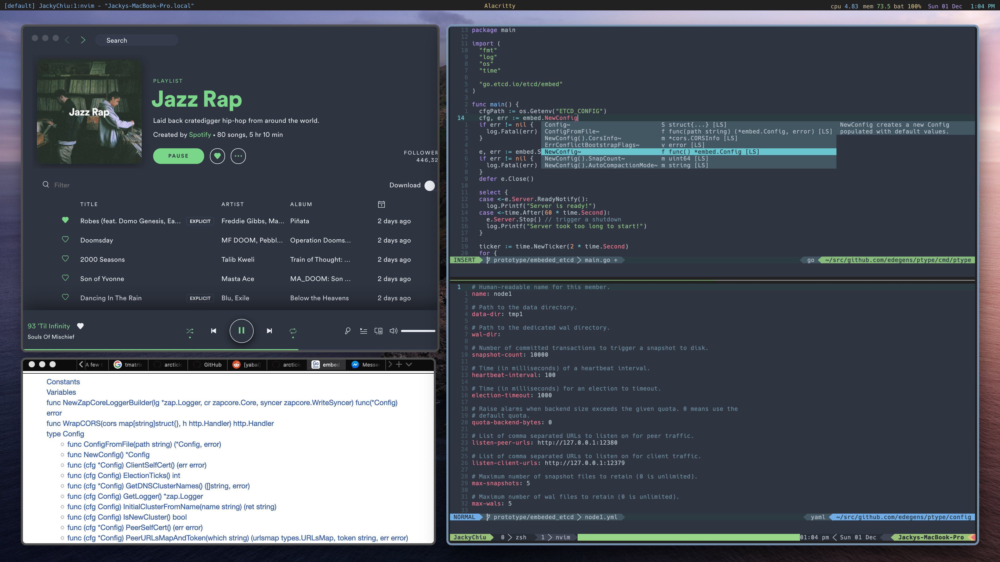

# One Dark Themed Nerdbar



[Übersicht](http://tracesof.net/uebersicht/) system information bar for use with kwm window manager. Personalized for my setup. The colours follow Atom's One Dark 

Features:
- Hack font
- kwm window mode | current application | task
- khd keybinding mode
- cpu percentage in use
- mem percentage in use
- battery percentage
- date
- 12 hour time



Original created by [herrbischoff](https://github.com/herrbischoff) 

## Installation

Make sure you have [Übersicht](http://tracesof.net/uebersicht/) installed.

Then clone this repository into your widgets folder.

```bash
git clone https://github.com/JackyChiu/nerdbar.widget $HOME/Library/Application\ Support/Übersicht/widgets/nerdbar.widget
```
